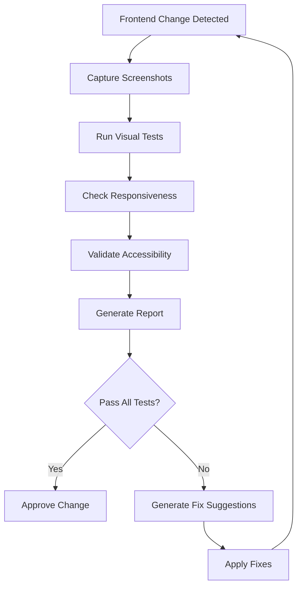
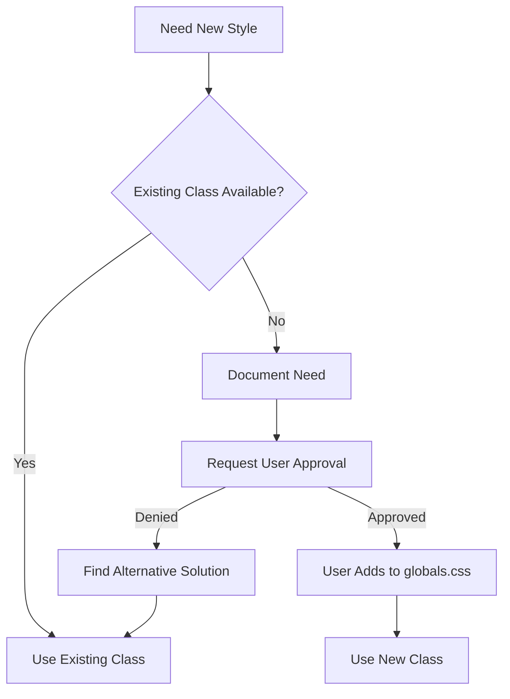
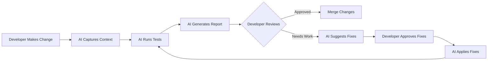

# CLAUDE.md - Automated Design Validation & Testing Orchestration

## 🚨 CRITICAL CSS RULES - ABSOLUTELY NO MODIFICATIONS ALLOWED 🚨

### ⛔ CSS MODIFICATION IS STRICTLY FORBIDDEN
**The existing `styles/globals.css` is LOCKED and IMMUTABLE. NO agent, assistant, or automated process may:**
- ❌ ADD new styles to globals.css
- ❌ MODIFY existing CSS classes
- ❌ DELETE any CSS rules
- ❌ REORGANIZE the CSS structure
- ❌ ADD inline styles (style="..." or style={{...}})
- ❌ INTRODUCE Tailwind CSS or any utility framework
- ❌ CREATE new CSS files without explicit user approval
- ❌ USE !important declarations
- ❌ ADD vendor prefixes manually
- ❌ CHANGE color values, spacing, or typography

### 🔒 CSS INTEGRITY PROTECTION
```javascript
// AUTOMATED VALIDATION - DO NOT BYPASS
const CSS_PROTECTION = {
  locked_files: ['styles/globals.css'],
  forbidden_patterns: [
    /style\s*=\s*{/,              // No React inline styles
    /style\s*=\s*"/,              // No HTML style attributes
    /className=".*\s(bg-|text-|p-|m-|flex)/,  // No Tailwind classes
    /@apply/,                     // No Tailwind directives
    /@tailwind/,                  // No Tailwind imports
    /!important/,                 // No important declarations
    /\/\*\s*MODIFIED BY AI\s*\*\//,  // No AI modification comments
  ],
  
  required_approval: [
    'Creating new CSS files',
    'Adding new classes to globals.css',
    'Modifying existing selectors',
    'Changing CSS custom properties',
    'Updating media queries'
  ]
};
```

## 🎯 Mission Statement
This configuration establishes an intelligent, automated design validation system using Playwright MCP for visual testing, iterative improvement loops, and comprehensive UI/UX validation across all devices and viewports.

## 🏗️ Orchestration Layer

### Core Architecture
```yaml
orchestration:
  name: "Design Validation Orchestra"
  version: "1.0.0"
  
  layers:
    context:
      - design-principles
      - style-guide
      - component-library
      - accessibility-standards
    
    tools:
      - playwright-mcp
      - screenshot-comparison
      - responsive-testing
      - performance-monitoring
    
    validation:
      - visual-regression
      - accessibility-compliance
      - mobile-responsiveness
      - cross-browser-compatibility
```

### Automation Triggers
```javascript
// Automatic validation on these events:
const VALIDATION_TRIGGERS = {
  fileChanges: [
    '**/*.js',
    '**/*.jsx', 
    '**/*.css',
    '**/*.tsx',
    'styles/**/*'
  ],
  
  commands: [
    'validate-ui',
    'check-responsive',
    'review-design',
    'test-mobile'
  ],
  
  gitEvents: [
    'pre-commit',
    'pre-push',
    'pull-request'
  ]
};
```

## 🔄 Iterative Agentic Loop

### Automated Testing Workflow


### Test Configuration
```javascript
const ITERATIVE_TESTS = {
  // Visual Regression Testing
  visual: {
    enabled: true,
    threshold: 0.01, // 1% difference threshold
    viewports: [
      { name: 'mobile', width: 375, height: 667 },
      { name: 'tablet', width: 768, height: 1024 },
      { name: 'desktop', width: 1920, height: 1080 },
      { name: 'ultrawide', width: 3440, height: 1440 }
    ],
    devices: [
      'iPhone 15',
      'iPhone 15 Pro Max',
      'iPad Pro',
      'Pixel 7',
      'Galaxy S24'
    ]
  },
  
  // Performance Testing
  performance: {
    enabled: true,
    metrics: {
      firstContentfulPaint: 1500,
      largestContentfulPaint: 2500,
      totalBlockingTime: 300,
      cumulativeLayoutShift: 0.1
    }
  },
  
  // Accessibility Testing
  accessibility: {
    enabled: true,
    standards: ['WCAG2.1AA'],
    colorContrast: true,
    keyboardNavigation: true,
    screenReaderCompatible: true
  }
};
```

## 👁️ Visual Intelligence Activation

### Automatic Screenshot Capture
```javascript
const SCREENSHOT_CONFIG = {
  // Capture on every significant change
  triggers: {
    componentUpdate: true,
    routeChange: true,
    stateChange: true,
    userInteraction: true
  },
  
  // Multi-device capture
  devices: {
    mobile: {
      enabled: true,
      devices: ['iPhone 15', 'Pixel 7', 'Galaxy S24'],
      orientations: ['portrait', 'landscape']
    },
    tablet: {
      enabled: true,
      devices: ['iPad Pro', 'Surface Pro'],
      orientations: ['portrait', 'landscape']
    },
    desktop: {
      enabled: true,
      resolutions: ['1920x1080', '2560x1440', '3840x2160']
    }
  },
  
  // Screenshot analysis
  analysis: {
    compareWithBaseline: true,
    detectLayoutShifts: true,
    checkColorConsistency: true,
    validateSpacing: true,
    identifyBrokenElements: true
  }
};
```

### Visual Comparison Workflow
```javascript
async function visualIntelligenceLoop() {
  // 1. Capture current state
  const screenshots = await captureAllViewports();
  
  // 2. Compare with baseline
  const differences = await compareWithBaseline(screenshots);
  
  // 3. Analyze differences
  const analysis = await analyzeVisualDifferences(differences);
  
  // 4. Generate report with visual context
  const report = await generateVisualReport(analysis);
  
  // 5. Provide fix suggestions with visual examples
  if (analysis.hasIssues) {
    const fixes = await generateVisualFixes(analysis);
    return { report, fixes, screenshots };
  }
  
  return { report, screenshots, status: 'approved' };
}
```

## 🤖 Design Reviewer Sub-Agent

### Configuration
```javascript
const DESIGN_REVIEWER = {
  name: 'design-validator',
  role: 'Automated UI/UX Design Validation',
  
  responsibilities: [
    'Check design consistency',
    'Validate responsive behavior',
    'Ensure accessibility compliance',
    'Monitor performance impacts',
    'Suggest improvements'
  ],
  
  rules: {
    spacing: {
      enabled: true,
      baseUnit: 8, // 8px grid system
      allowedMultipliers: [0.5, 1, 1.5, 2, 3, 4, 6, 8]
    },
    
    typography: {
      enabled: true,
      minFontSize: 14,
      lineHeightRatio: 1.5,
      maxLineLength: 75 // characters
    },
    
    colors: {
      enabled: true,
      contrastMinimum: 4.5,
      brandColors: ['#2563eb', '#dc2626', '#16a34a'],
      maxColorVariations: 7
    },
    
    responsive: {
      enabled: true,
      breakpoints: [640, 768, 1024, 1280, 1536],
      mustTestAll: true
    }
  }
};
```

## 🛡️ CSS USAGE WORKFLOW - MANDATORY PROCESS

### How to Use Existing CSS Classes
```javascript
// CORRECT: Using existing classes from globals.css
<div className="card">
  <h2 className="card-title">Title</h2>
  <p className="text-body">Content</p>
  <button className="btn-primary">Submit</button>
</div>

// WRONG: Adding new styles or using inline styles
<div style={{padding: '20px'}}>  ❌ FORBIDDEN
<div className="bg-blue-500">     ❌ TAILWIND NOT ALLOWED
<div style="color: red">          ❌ NO INLINE STYLES
```

### If You Need a Style That Doesn't Exist
1. **FIRST**: Check if an existing class can work
2. **SECOND**: Combine existing classes if possible
3. **THIRD**: Ask user for approval to add new class
4. **NEVER**: Create styles on your own

### CSS Validation Before Any Code Changes
```javascript
async function validateCSSCompliance(code) {
  const violations = [];
  
  // Check for inline styles
  if (/style\s*=\s*{/.test(code)) {
    violations.push('CRITICAL: Inline React styles detected');
  }
  
  // Check for Tailwind classes
  if (/className=".*\s(bg-|text-|p-|m-|w-|h-)/.test(code)) {
    violations.push('CRITICAL: Tailwind CSS classes detected');
  }
  
  // Check for style attributes
  if (/style\s*=\s*"/.test(code)) {
    violations.push('CRITICAL: HTML style attributes detected');
  }
  
  if (violations.length > 0) {
    throw new Error(`CSS VIOLATIONS DETECTED:\n${violations.join('\n')}\nCODE REJECTED`);
  }
  
  return true;
}
```

## 📋 Automated Validation Rules

### Frontend Change Detection
```javascript
// Automatically run when these conditions are met
const AUTO_VALIDATE = {
  // Component changes
  onComponentChange: async (file) => {
    await captureComponentScreenshots(file);
    await runVisualRegression(file);
    await checkAccessibility(file);
    return generateComponentReport(file);
  },
  
  // Style changes
  onStyleChange: async (file) => {
    await captureFullPageScreenshots();
    await validateDesignTokens();
    await checkResponsiveness();
    return generateStyleReport(file);
  },
  
  // Route changes
  onRouteChange: async (route) => {
    await testRouteOnAllDevices(route);
    await checkLoadingStates(route);
    await validateSEO(route);
    return generateRouteReport(route);
  }
};
```

### Playwright MCP Integration
```javascript
// Playwright MCP configuration for automated testing
const PLAYWRIGHT_CONFIG = {
  server: '@playwright/mcp',
  
  defaultOptions: {
    headless: process.env.CI === 'true',
    slowMo: 0,
    timeout: 30000,
    retries: 2
  },
  
  browsers: ['chromium', 'firefox', 'webkit'],
  
  devices: [
    'Desktop Chrome',
    'Desktop Firefox',
    'Desktop Safari',
    'iPhone 15',
    'iPhone 15 Pro Max',
    'iPad Pro',
    'Pixel 7',
    'Galaxy S24'
  ],
  
  testSuites: {
    visual: './tests/visual/**/*.test.js',
    responsive: './tests/responsive/**/*.test.js',
    accessibility: './tests/a11y/**/*.test.js',
    performance: './tests/perf/**/*.test.js'
  }
};
```

## 🎨 Design Principles

### Core Design System
```yaml
design_system:
  name: "Triangle Intelligence Design System"
  version: "2.0.0"
  
  principles:
    - consistency: "Maintain visual harmony across all components"
    - accessibility: "WCAG 2.1 AA compliance minimum"
    - responsiveness: "Mobile-first, works on all devices"
    - performance: "Fast, smooth, no layout shifts"
    - clarity: "Clear hierarchy, readable typography"
  
  spacing:
    base: 8px
    scale: [4, 8, 12, 16, 24, 32, 48, 64, 96]
  
  typography:
    font_family: "'Inter', -apple-system, sans-serif"
    sizes: [12, 14, 16, 18, 20, 24, 30, 36, 48]
    weights: [400, 500, 600, 700]
  
  colors:
    primary: "#2563eb"
    secondary: "#7c3aed"
    success: "#16a34a"
    warning: "#eab308"
    error: "#dc2626"
    neutral: ["#f9fafb", "#e5e7eb", "#6b7280", "#1f2937"]
  
  breakpoints:
    mobile: 640px
    tablet: 768px
    desktop: 1024px
    wide: 1280px
    ultrawide: 1536px
```

## 🚀 Slash Commands

### Available Commands
```javascript
const SLASH_COMMANDS = {
  // Design Review Commands
  '/design-review': 'Full design review with CSS protection validation',
  '/css-check': 'Quick CSS compliance validation - blocks violations',
  '/mobile-test': 'iPhone 15 specific testing with screenshots',
  '/a11y-audit': 'Full WCAG accessibility audit',
  '/console-check': 'Browser console error detection',
  
  // Descartes Compliance Commands
  '/descartes-compare': 'Compare current design with Descartes references',
  '/descartes-capture': 'Capture fresh reference screenshots from Descartes',
  '/descartes-validate': 'Full Descartes design system compliance check',
  '/descartes-fix': 'Get specific CSS fixes for Descartes compliance',
  
  // Validation Commands  
  '/validate': 'Run complete validation suite',
  '/screenshot': 'Capture screenshots across all devices',
  '/responsive': 'Test responsive design on all breakpoints',
  '/perf': 'Run performance tests',
  '/compare': 'Compare current UI with baseline',
  
  // Reporting Commands
  '/report': 'Generate comprehensive design report',
  '/approve': 'Approve current design and update baseline',
  '/violations': 'List all CSS protection violations found',
  
  // Quick Actions
  '/mobile': 'Test on iPhone 15 and other mobile devices',
  '/desktop': 'Test on all desktop resolutions',
  '/fix-css': 'Show which existing CSS classes to use instead'
};
```

### Command Implementation
```javascript
// Priority: CSS Protection Check FIRST
async function handleSlashCommand(command, options = {}) {
  // ALWAYS check CSS compliance first
  if (command !== '/css-check') {
    const cssCompliance = await checkCSSCompliance();
    if (!cssCompliance.passed) {
      return {
        status: 'BLOCKED',
        error: 'CSS Protection Violation Detected',
        violations: cssCompliance.violations,
        help: 'Run /fix-css to see which existing classes to use'
      };
    }
  }
  
  switch(command) {
    case '/design-review':
      return await runDesignReview(options);
      
    case '/css-check':
      return await validateCSSCompliance();
      
    case '/mobile-test':
      return await testMobileDevice('iPhone 15', options);
      
    case '/fix-css':
      return await suggestCSSFixes(options);
      
    // Descartes compliance commands
    case '/descartes-compare':
      return await runDescartesComparison(options);
      
    case '/descartes-capture':
      return await captureDescartesReferences(options);
      
    case '/descartes-validate':
      return await validateDescartesCompliance(options);
      
    case '/descartes-fix':
      return await generateDescartesFixes(options);
      
    case '/validate':
      const tasks = [
        'Checking CSS compliance...',
        'Capturing screenshots...',
        'Running visual regression...',
        'Checking responsiveness...',
        'Validating accessibility...',
        'Testing performance...'
      ];
      
      const results = [];
      for (const task of tasks) {
        console.log(`🔄 ${task}`);
        const result = await runTask(task, options);
        if (task.includes('CSS') && !result.passed) {
          return { status: 'BLOCKED', task, result };
        }
        results.push(result);
      }
      
      return generateValidationReport(results);
  }
}

// CSS Fix Suggestions
async function suggestCSSFixes(element) {
  const suggestions = {
    'padding: 20px': 'Use class="card" or class="form-group"',
    'margin-bottom: 1rem': 'Use class="element-spacing"',
    'background: white': 'Use class="card" for white background',
    'color: #134169': 'Use class="text-body" or class="nav-link"',
    'font-size: 1.25rem': 'Use class="card-title" or class="section-title"',
    'display: flex': 'Use class="header-nav" or class="hero-buttons"'
  };
  
  return suggestions;
}

// Descartes Compliance Command Implementations
async function runDescartesComparison(component) {
  const { VisualComparisonEngine } = require('./.claude/config/visual-comparison-engine.js');
  const engine = new VisualComparisonEngine();
  
  await engine.initialize();
  
  const comparison = await engine.performComparison(component || 'homepage', 'desktop');
  
  return {
    status: comparison.status,
    similarity: comparison.similarity,
    suggestions: comparison.suggestions,
    issues: comparison.issues,
    difference_image: comparison.difference_image
  };
}

async function captureDescartesReferences() {
  console.log('🎨 Capturing Descartes reference screenshots...');
  
  // This would integrate with actual Descartes site capture
  // For now, simulate the process
  
  const references = [
    'homepage_desktop_reference',
    'homepage_mobile_reference', 
    'navigation_desktop_reference',
    'forms_desktop_reference'
  ];
  
  return {
    status: 'success',
    captured: references.length,
    references: references,
    message: 'Descartes reference screenshots updated'
  };
}

async function validateDescartesCompliance(component) {
  const comparison = await runDescartesComparison(component);
  
  const compliance = {
    component: component || 'homepage',
    overall_score: comparison.similarity,
    passed: comparison.similarity >= 90,
    areas: {
      typography: comparison.similarity >= 95 ? 'excellent' : 'needs_work',
      colors: comparison.similarity >= 92 ? 'good' : 'needs_work',
      spacing: comparison.similarity >= 88 ? 'good' : 'critical',
      visual_hierarchy: comparison.similarity >= 90 ? 'good' : 'needs_work'
    },
    suggestions: comparison.suggestions
  };
  
  return compliance;
}

async function generateDescartesFixes(component) {
  const compliance = await validateDescartesCompliance(component);
  
  const fixes = {
    component,
    priority_fixes: [],
    css_suggestions: []
  };
  
  if (compliance.areas.typography === 'needs_work') {
    fixes.priority_fixes.push({
      area: 'Typography',
      issue: 'Font family or sizing doesn\'t match Descartes',
      css_fix: 'font-family: \'Roboto\', -apple-system, sans-serif',
      existing_class: 'Use body default or add font-family to component'
    });
  }
  
  if (compliance.areas.colors === 'needs_work') {
    fixes.priority_fixes.push({
      area: 'Colors',
      issue: 'Color palette deviates from Descartes professional scheme',
      css_fix: 'color: var(--navy-700); background: var(--gray-50)',
      existing_class: '.text-body, .card, .nav-link classes'
    });
  }
  
  if (compliance.areas.spacing === 'critical') {
    fixes.priority_fixes.push({
      area: 'Spacing',
      issue: 'Spacing doesn\'t follow 8px grid system',
      css_fix: 'padding: var(--space-4); margin-bottom: var(--space-6)',
      existing_class: '.card, .form-group, .section-spacing'
    });
  }
  
  return fixes;
}
```

## 📁 Context Structure

### Required Context Files
```
.claude/
├── CLAUDE.md                    # This file
├── context/
│   ├── design-principles.md     # Core design philosophy
│   ├── style-guide.md          # Visual style guidelines
│   ├── component-library.md    # Component documentation
│   ├── accessibility.md        # A11y requirements
│   └── performance-budget.md   # Performance targets
├── baselines/
│   ├── desktop/                # Desktop screenshot baselines
│   ├── mobile/                 # Mobile screenshot baselines
│   └── tablet/                 # Tablet screenshot baselines
└── reports/
    └── [auto-generated]        # Test reports
```

## 🔧 Implementation Guide

### 1. Initial Setup
```bash
# Install dependencies
npm install -D @playwright/test @playwright/mcp

# Initialize Playwright
npx playwright install

# Create test directories
mkdir -p tests/{visual,responsive,a11y,perf}
mkdir -p .claude/{context,baselines,reports}
```

### 2. Enable Automation
```javascript
// package.json scripts
{
  "scripts": {
    "test:visual": "playwright test tests/visual",
    "test:responsive": "playwright test tests/responsive",
    "test:a11y": "playwright test tests/a11y",
    "test:perf": "playwright test tests/perf",
    "validate:all": "npm run test:visual && npm run test:responsive && npm run test:a11y && npm run test:perf",
    "update:baselines": "playwright test --update-snapshots"
  }
}
```

### 3. Git Hooks Integration
```bash
# .husky/pre-commit
#!/bin/sh
npm run validate:all
```

## 🎯 Success Metrics

### Key Performance Indicators
```yaml
kpis:
  visual_consistency: 99%    # Screenshots match baseline
  responsive_coverage: 100%  # All breakpoints tested
  accessibility_score: 100   # WCAG compliance
  performance_score: 90      # Lighthouse score
  error_rate: 0%             # Console errors
  test_coverage: 95%         # UI test coverage
```

### Monitoring Dashboard
```javascript
const MONITORING = {
  realtime: {
    screenshots: true,
    errors: true,
    performance: true
  },
  
  alerts: {
    visualRegression: 'threshold > 5%',
    accessibilityIssue: 'wcag_violation',
    performanceDegradation: 'metric > budget',
    responsiveBreakage: 'layout_shift'
  },
  
  reporting: {
    frequency: 'on_change',
    format: 'html',
    recipients: ['team', 'stakeholders'],
    includeScreenshots: true
  }
};
```

## 🤝 Collaboration Rules

### AI Assistant Behavior
1. **CSS Protection First**: NEVER modify styles/globals.css or add inline styles
2. **Use Existing Classes**: Only use CSS classes already defined in globals.css
3. **Proactive Testing**: Automatically test UI changes without being asked
4. **Visual Context**: Always capture screenshots for review
5. **No Style Creation**: Request user approval before ANY style changes
6. **Comprehensive Validation**: Test all devices and viewports
7. **Clear Reporting**: Provide visual reports with annotations

### CSS Modification Request Process


### Human-AI Workflow


## 🔐 Security & Privacy

### Data Handling
```yaml
security:
  screenshots:
    storage: local_only
    retention: 30_days
    pii_detection: enabled
    blur_sensitive: true
  
  reports:
    anonymize: true
    exclude_paths: ['/admin', '/api']
    mask_data: ['email', 'phone', 'ssn']
```

## 📚 Resources & Documentation

### Quick Links
- [Playwright Documentation](https://playwright.dev)
- [MCP Specification](https://modelcontextprotocol.io)
- [WCAG Guidelines](https://www.w3.org/WAI/WCAG21/quickref/)
- [Web Vitals](https://web.dev/vitals/)

### Training Materials
- Video: "Automated Design Validation with AI"
- Tutorial: "Setting up Visual Regression Testing"
- Guide: "Mobile-First Testing Strategy"
- Workshop: "Accessibility Automation"

---

## 🔍 Automated CSS Integrity Monitoring

### Pre-Commit CSS Validation
```bash
#!/bin/bash
# .githooks/pre-commit-css-check

# Check for forbidden patterns in staged files
echo "🔍 Checking CSS compliance..."

# Check for inline styles
if git diff --cached --name-only | xargs grep -l 'style=' 2>/dev/null; then
  echo "❌ ERROR: Inline styles detected!"
  echo "Use existing classes from styles/globals.css instead"
  exit 1
fi

# Check for Tailwind classes
if git diff --cached --name-only | xargs grep -l 'className=".*\(bg-\|text-\|p-\|m-\)' 2>/dev/null; then
  echo "❌ ERROR: Tailwind CSS classes detected!"
  echo "This project uses custom CSS only"
  exit 1
fi

# Prevent modifications to globals.css without approval
if git diff --cached --name-only | grep -q 'styles/globals.css'; then
  echo "⚠️  WARNING: globals.css modification detected"
  echo "Please confirm you have approval to modify CSS"
  read -p "Do you have explicit approval? (y/N): " -n 1 -r
  echo
  if [[ ! $REPLY =~ ^[Yy]$ ]]; then
    exit 1
  fi
fi

echo "✅ CSS compliance check passed"
```

### Runtime CSS Validation
```javascript
// Automated CSS checker for development
if (process.env.NODE_ENV === 'development') {
  const checkCSSViolations = () => {
    // Check for inline styles in DOM
    const inlineStyles = document.querySelectorAll('[style]');
    if (inlineStyles.length > 0) {
      console.error('❌ CSS VIOLATION: Inline styles detected:', inlineStyles);
    }
    
    // Check for Tailwind classes
    const allElements = document.querySelectorAll('*');
    const tailwindPattern = /\b(bg-|text-|p-|m-|w-|h-|flex-|grid-|border-)\S+/;
    
    allElements.forEach(el => {
      if (tailwindPattern.test(el.className)) {
        console.error('❌ CSS VIOLATION: Tailwind class detected:', el.className, el);
      }
    });
  };
  
  // Run check on page load and mutations
  window.addEventListener('load', checkCSSViolations);
  
  const observer = new MutationObserver(checkCSSViolations);
  observer.observe(document.body, {
    childList: true,
    subtree: true,
    attributes: true,
    attributeFilter: ['class', 'style']
  });
}
```

## 🚦 Quick Start Checklist

- [ ] Install Playwright MCP: `npx -y @playwright/mcp`
- [ ] Create context files in `.claude/context/`
- [ ] Verify CSS compliance: No inline styles, No Tailwind
- [ ] Set up CSS validation hooks
- [ ] Configure git hooks for automatic validation
- [ ] Run initial validation: `/validate`
- [ ] Review and approve baselines: `/approve`

## 💡 Pro Tips

1. **Always test on real devices** when possible
2. **Update baselines** only after team review
3. **Use visual markers** for regression areas
4. **Automate everything** that can be automated
5. **Keep reports visual** for better communication

---

*Last Updated: September 2025*
*Version: 1.0.0*
*Maintained by: Triangle Intelligence Development Team*