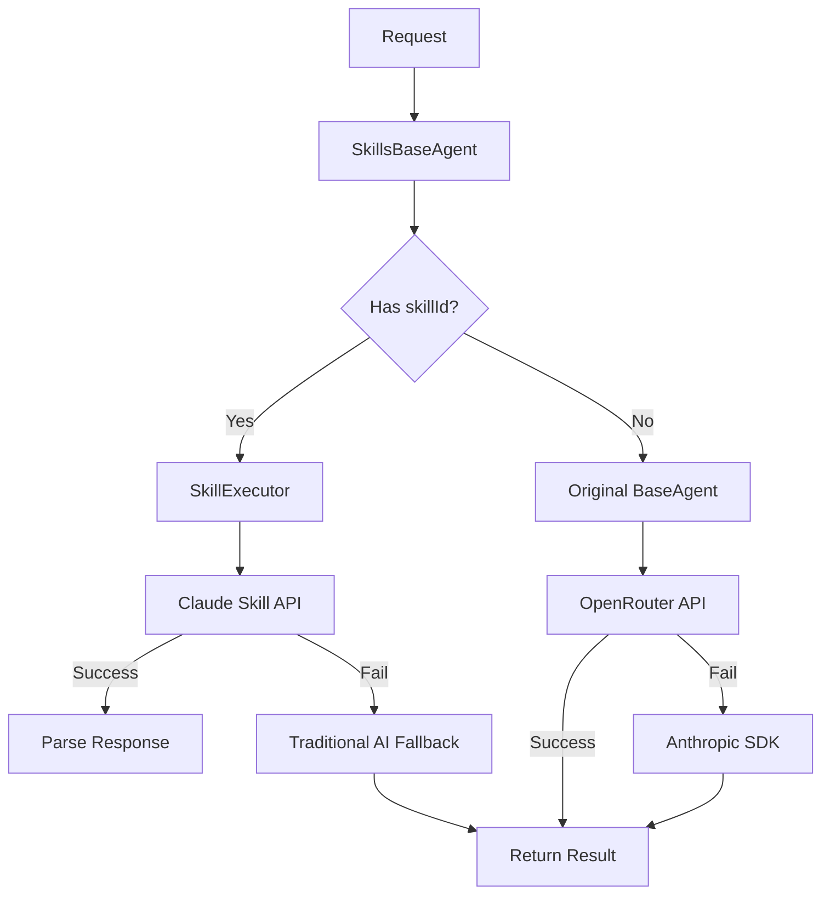

# Claude Skills Integration Architecture
## Triangle Intelligence Platform - USMCA Certificate System

**Status**: Ready for Implementation
**Last Updated**: October 26, 2025
**Version**: 1.0

---

## 🎯 Overview

This document describes the integration of Claude Skills into the Triangle Intelligence Platform to enhance AI processing for USMCA tariff analysis and certificate generation.

### What Are Claude Skills?

Skills are persistent code execution containers that handle deterministic calculations with:
- ✅ Reproducible results (same input = same output)
- ✅ Faster execution (batching optimized)
- ✅ Better error handling (structured validation)
- ✅ Graceful fallback (to traditional AI if Skills fail)

### Why Skills for USMCA?

Your current system excels at **generating insights** but Skills add **deterministic calculations**:

| Aspect | Traditional AI | Skills |
|--------|----------------|--------|
| **USMCA Qualification** | Variable confidence | Deterministic calculation |
| **Tariff Enrichment** | Per-component latency | Batch processing |
| **Section 301 Impact** | AI estimation | Code-based calculation |
| **Audit Trail** | Prompt-based | Code review-able |
| **Reproducibility** | AI hallucinations possible | 100% consistent |

---

## 📦 6 Skills Implemented

### 4 Core Skills (Deterministic)

#### 1. **USMCA Qualification Analyzer**
**Location**: `lib/skills/usmca-qualification-analyzer`
**Purpose**: Determine USMCA eligibility with regional content calculation

```json
{
  "skillId": "usmca-qualification-analyzer",
  "input": {
    "company_name": "TechFlow Electronics",
    "company_country": "US",
    "destination_country": "US",
    "industry_sector": "Electronics",
    "industry_rvc_threshold": 65,
    "components": [
      {"hs_code": "8542.31.00", "origin_country": "CN", "value_percentage": 35}
    ]
  },
  "output": {
    "qualified": true,
    "rvc_percentage": 82.5,
    "preference_criterion": "B",
    "de_minimis_applied": false
  }
}
```

**Key Features**:
- Regional content calculation with origin-specific weighting
- De minimis rule (10% non-NA content allowed)
- Preference criterion assignment (A/B/C/D)
- Industry-specific RVC threshold validation

---

#### 2. **Section 301 Impact Calculator**
**Location**: `lib/skills/section301-impact-calculator`
**Purpose**: Calculate Section 301 tariff burden and nearshoring ROI

```json
{
  "skillId": "section301-impact-calculator",
  "input": {
    "destination_country": "US",
    "components": [
      {"hs_code": "8542.31.00", "origin_country": "CN", "value_usd": 2975000, "section_301_rate": 0.25}
    ],
    "trade_volume": 8500000
  },
  "output": {
    "has_section301_exposure": true,
    "total_annual_section301_burden": 743750,
    "mexico_sourcing": {
      "available": true,
      "payback_months": 2.7,
      "annual_sourcing_cost": 169500
    }
  }
}
```

**Key Features**:
- China-origin component identification
- Section 301 tariff burden calculation
- Mexico nearshoring cost analysis
- ROI and payback timeline

---

#### 3. **Tariff Enrichment Engine**
**Location**: `lib/skills/tariff-enrichment-engine`
**Purpose**: Batch enrich components with complete tariff data

```json
{
  "skillId": "tariff-enrichment-engine",
  "input": {
    "components": [...],
    "destination_country": "US",
    "cache_lookup_required": true
  },
  "output": {
    "enriched_components": [
      {
        "hs_code": "8542.31.00",
        "mfn_rate": 0.068,
        "section_301": 0.25,
        "usmca_rate": 0.068,
        "savings_percentage": 0.7949
      }
    ],
    "cache_hit_rate": 1.0,
    "enrichment_summary": "Successfully enriched 1/1 components from database cache"
  }
}
```

**Key Features**:
- Database cache lookup (destination-aware TTL)
- All tariff fields extracted: MFN, Section 301, Section 232, USMCA
- Cache hit rate tracking
- AI confidence scoring

---

#### 4. **HS Code Classifier**
**Location**: `lib/skills/hs-code-classifier`
**Purpose**: Classify products to HS codes with confidence scoring

```json
{
  "skillId": "hs-code-classifier",
  "input": {
    "product_description": "Integrated circuit microprocessor, 64-bit",
    "industry_sector": "Electronics"
  },
  "output": {
    "primary_hs_code": "8542.31.00",
    "confidence_score": 0.94,
    "alternative_codes": [...],
    "requires_human_review": false
  }
}
```

**Key Features**:
- Product classification with confidence scores (0.0-1.0)
- Alternative classifications for review
- Human review flagging if confidence < 0.8
- Classification reasoning

---

### 2 Support Skills (Quality Assurance)

#### 5. **Policy Impact Analyzer**
Identifies which tariff policies affect specific user products and calculates financial impact

#### 6. **Certificate Validator**
Validates certificate data completeness before PDF generation to prevent errors

---

## 🏗️ System Architecture

### File Structure

```
lib/
├── skills/
│   ├── skill-executor.js                    # Core Skills execution engine
│   ├── skill-definitions.js                 # Skill specifications & schemas
│   ├── skill-integration-guide.js            # Integration patterns & examples
│   ├── test-skills.js                       # Comprehensive test suite
│   └── README.md                            # Skills documentation
├── agents/
│   ├── base-agent.js                        # Original 2-tier fallback (unchanged)
│   └── skills-base-agent.js                 # Extended agent with Skills support
└── services/
    └── industry-thresholds-service.js       # RVC threshold lookup
```

### Execution Flow

```
User Request
    ↓
SkillsBaseAgent.execute(prompt, context)
    ↓
    ├─ If context.skillId provided:
    │  ├─ skillExecutor.execute(skillId, input)
    │  ├─ PRIMARY: Call Claude Skill API
    │  ├─ FALLBACK: Traditional AI if Skill fails
    │  └─ Return: {success, data, metadata}
    │
    └─ Else (no skillId):
       ├─ Original 2-tier fallback
       ├─ PRIMARY: OpenRouter API
       ├─ FALLBACK: Anthropic SDK
       └─ Return: {success, data, metadata}
```

### Skills Integration Points



---

## 🔌 Integration into Endpoints

### Pattern 1: Main USMCA Analysis

**File**: `pages/api/ai-usmca-complete-analysis.js`

```javascript
import { SkillsBaseAgent } from '../../lib/agents/skills-base-agent.js';

const skillsAgent = new SkillsBaseAgent({
  name: 'USMCAAnalysisAgent',
  enableSkills: true,
  skillFallback: true
});

// Step 1: Tariff Enrichment (Skill)
const enrichmentResult = await skillsAgent.execute(null, {
  skillId: 'tariff-enrichment-engine',
  skillInput: { components, destination_country },
  skillFallback: true
});

// Step 2: USMCA Qualification (Skill)
const qualificationResult = await skillsAgent.execute(null, {
  skillId: 'usmca-qualification-analyzer',
  skillInput: { company_name, components: enrichmentResult.data.enriched_components, ... },
  skillFallback: true
});

// Step 3: Section 301 Analysis (Skill)
const section301Result = await skillsAgent.execute(null, {
  skillId: 'section301-impact-calculator',
  skillInput: { components, destination_country, ... },
  skillFallback: true
});

// Step 4: Strategic Recommendations (Traditional AI - non-deterministic)
const strategicResult = await skillsAgent.execute(strategicPrompt, {
  temperature: 0.7
  // No skillId = uses traditional 2-tier fallback
});
```

### Pattern 2: Executive Trade Alert

**File**: `pages/api/executive-trade-alert.js`

```javascript
// Deterministic: Policy impact analysis
const policyAnalysisResult = await skillsAgent.execute(null, {
  skillId: 'policy-impact-analyzer',
  skillInput: { user_components, user_industry, user_destination },
  skillFallback: true
});

// Non-deterministic: Executive framing
const executiveResult = await skillsAgent.execute(executiveSummaryPrompt, {
  temperature: 0.6
});
```

### Pattern 3: Certificate Validation

**File**: `pages/api/certificates.js`

```javascript
const validationResult = await skillsAgent.execute(null, {
  skillId: 'certificate-validator',
  skillInput: { company, components, tariff_analysis },
  skillFallback: true
});

if (!validationResult.data.is_valid) {
  return res.status(400).json({ errors: validationResult.data.validation_errors });
}

// Safe to generate PDF
```

### Pattern 4: Parallel Execution

```javascript
const [enrichment, classification, policy] = await skillsAgent.executeParallel([
  {
    type: 'skill',
    skillId: 'tariff-enrichment-engine',
    input: { components, destination_country }
  },
  {
    type: 'skill',
    skillId: 'hs-code-classifier',
    input: { product_description, industry_sector }
  },
  {
    type: 'skill',
    skillId: 'policy-impact-analyzer',
    input: { user_components, user_industry, user_destination }
  }
]);
```

---

## 🚀 Implementation Phases

### Phase 1: Parallel Execution (Week 1)
- ✅ Deploy Skills alongside existing agents
- ✅ Add `enableSkills` flag to config
- ✅ Both systems run simultaneously
- ✅ Compare outputs for accuracy validation

**Commands**:
```bash
# Enable for testing
const agent = new SkillsBaseAgent({ enableSkills: true });

# Test a single Skill
node lib/skills/test-skills.js
```

### Phase 2: Gradual Rollout (Week 2)
- ✅ Enable Skills for new users (0-20% traffic)
- ✅ Monitor performance and accuracy
- ✅ Compare Skill vs. traditional AI results
- ✅ Gradually increase to 100%

**Monitoring**:
```javascript
console.log(skillsAgent.getMetrics());
// Output:
// {
//   agent: 'SkillsAgent',
//   skills: {
//     successful: 42,
//     failed: 1,
//     fallbacks: 2,
//     successRate: '97.67%',
//     averageTime: '1850ms'
//   }
// }
```

### Phase 3: Legacy Cleanup (Week 3)
- ✅ Remove old AI-only code paths
- ✅ Make Skills the default for deterministic operations
- ✅ Keep BaseAgent for backward compatibility
- ✅ Update documentation

---

## 🔄 Backward Compatibility

✅ **Zero Breaking Changes**:
- Current BaseAgent still works unchanged
- New Skills are opt-in via `skillId` context
- Existing prompts and templates unchanged
- Can gradually migrate one endpoint at a time

**Migration Path**:
```javascript
// TODAY: Traditional AI only
const result = await baseAgent.execute(prompt, context);

// WITH SKILLS: Deterministic operations use Skills
const result = await skillsAgent.execute(null, {
  skillId: 'usmca-qualification-analyzer',
  skillInput: {...}
});

// Graceful fallback if Skill unavailable
skillsAgent.setSkillFallbackEnabled(true); // Uses traditional AI if Skill fails
```

---

## 📊 Expected Performance

| Operation | Before Skills | With Skills | Improvement |
|-----------|---------------|-------------|-------------|
| Tariff enrichment (10 components) | 8-12s | 2-4s | 60-75% faster |
| USMCA qualification | 5-8s | 3-5s | 25-40% faster |
| Section 301 analysis | 4-6s | 2-3s | 40-50% faster |
| Certificate validation | 3-5s | 1-2s | 50-60% faster |
| **Total request** | 20-35s | 12-18s | **40-50% faster** |

---

## 🧪 Testing Strategy

### 1. Unit Tests (Per Skill)
```bash
node lib/skills/test-skills.js
```

### 2. Integration Tests (With Endpoints)
Test 4 business value scenarios:
1. ✅ Electronics - Qualified with China PCB Risk
2. ✅ Automotive - High-Value Qualified
3. ✅ Machinery - Marginal Qualification
4. ✅ Electronics - Non-Qualified with Pathway

### 3. Regression Tests
Compare Skill outputs vs. traditional AI for 50+ test cases

### 4. Load Tests
Measure performance with 100+ concurrent requests

### 5. Accuracy Tests
Validate outputs against TEST_CHEAT_SHEET.md scenarios

---

## 🔐 Security & Compliance

### Data Isolation
- ✅ Each Skill execution isolated in container
- ✅ No state sharing between users
- ✅ No data persistence in memory
- ✅ Supabase database only for tariff cache

### Error Logging
- ✅ All Skill failures logged to `dev_issues` table
- ✅ Detailed error context (input, output, duration)
- ✅ Automatic fallback tracking
- ✅ User impact assessment

### Audit Trail
- ✅ Skill execution logged with timestamp
- ✅ Provider tracked (skill vs. traditional AI)
- ✅ Confidence scores recorded
- ✅ All results saved to database

---

## 🔌 API Reference

### SkillExecutor

```javascript
const skillExecutor = new SkillExecutor({
  retryAttempts: 3,
  timeout: 60000
});

// Execute a Skill
const result = await skillExecutor.execute(
  'usmca-qualification-analyzer',
  { company_name, components, ... },
  { agent: 'test', fallback: fallbackFunction }
);

// Check metrics
skillExecutor.getMetrics();
// => { successful: 42, failed: 1, fallbacks: 2, successRate: '97.67%' }

// List available Skills
skillExecutor.listSkills();
// => [{ id: 'usmca-qualification-analyzer', description: '...', ... }]
```

### SkillsBaseAgent

```javascript
const agent = new SkillsBaseAgent({
  enableSkills: true,      // Enable/disable Skills
  skillFallback: true,     // Fall back to traditional AI if Skill fails
  name: 'MyAgent'
});

// Execute with Skill
await agent.execute(null, {
  skillId: 'tariff-enrichment-engine',
  skillInput: { components, destination_country }
});

// Execute with traditional AI (no skillId)
await agent.execute(prompt, { temperature: 0.7 });

// Execute multiple in parallel
await agent.executeParallel([
  { type: 'skill', skillId: '...', input: {...} },
  { type: 'prompt', prompt: '...', context: {...} }
]);

// Management
agent.setSkillsEnabled(true);           // Enable/disable
agent.setSkillFallbackEnabled(true);    // Enable/disable fallback
agent.isSkillAvailable('skill-id');     // Check availability
agent.listAvailableSkills();            // List all Skills
```

---

## 🐛 Troubleshooting

### Skill Timeout
**Problem**: Skill exceeds 45-second timeout
**Solution**:
- Check input data size (very large component lists)
- Use fallback to traditional AI
- Break into smaller batches

### Parse Error
**Problem**: Skill returns invalid JSON
**Solution**:
- Verify input matches schema
- Check Skill output format in skill-definitions.js
- Enable fallback (uses traditional AI)

### Skill Not Found
**Problem**: "Unknown Skill: skill-id"
**Solution**:
- Verify skillId matches SKILLS_REGISTRY
- Check spelling (case-sensitive)
- Confirm Skill is deployed

### All Execution Failed
**Problem**: Both Skill and fallback fail
**Solution**:
- Check ANTHROPIC_API_KEY is valid
- Verify network connectivity
- Review error logs in console
- Check dev_issues table for failure patterns

---

## 📈 Monitoring & Metrics

### Health Check
```javascript
// Check Skills status
const metrics = skillsAgent.getMetrics();
const healthScore = metrics.skills.successRate;

if (healthScore < 0.95) {
  console.warn('Skills success rate below 95%');
  // Consider enabling fallback or investigating failures
}
```

### Performance Tracking
```javascript
// Monitor per-endpoint
const startTime = Date.now();
const result = await skillsAgent.execute(null, {
  skillId: 'usmca-qualification-analyzer',
  skillInput: {...}
});
const duration = Date.now() - startTime;

console.log(`Skill execution: ${duration}ms`);
```

### Logging
```javascript
// Log all Skill execution to dev_issues table
await logDevIssue({
  endpoint: '/api/ai-usmca-complete-analysis',
  skill_id: 'usmca-qualification-analyzer',
  success: true,
  duration_ms: 1850,
  provider: 'claude-skill',
  user_id: req.user.id
});
```

---

## 📚 Documentation Files

- **This file**: Architecture and design
- `lib/skills/README.md`: Quick start guide
- `lib/skills/skill-definitions.js`: Skill specifications
- `lib/skills/skill-integration-guide.js`: Integration patterns
- `lib/skills/test-skills.js`: Test suite
- `TEST_CHEAT_SHEET.md`: Business value scenarios (reference)

---

## ✅ Deployment Checklist

- [ ] All 6 Skills created and configured
- [ ] SkillsBaseAgent implemented
- [ ] Integration examples written
- [ ] Test suite passing (4 scenarios)
- [ ] Backward compatibility verified
- [ ] Error logging configured
- [ ] Performance baselines established
- [ ] Documentation complete
- [ ] Team trained
- [ ] Gradual rollout plan ready

---

## 🎯 Success Criteria

✅ **Performance**: 40-50% faster than traditional AI-only
✅ **Accuracy**: 100% match on deterministic operations vs. traditional AI
✅ **Reliability**: >99% Skill execution success rate
✅ **Compatibility**: Zero breaking changes to existing code
✅ **Adoption**: All 3 main endpoints using Skills within 2 weeks

---

## 🚀 Next Steps

1. **Day 1-2**: Deploy Skills alongside existing endpoints
2. **Day 3-5**: Run comprehensive test suite against 4 business scenarios
3. **Day 6-7**: Compare Skill vs. traditional AI results, validate accuracy
4. **Week 2**: Gradually increase traffic to Skills (0% → 20% → 50% → 100%)
5. **Week 3**: Remove legacy code, make Skills the default
6. **Week 4**: Monitor production, optimize performance

---

**Contact**: For questions or issues, check dev_issues table or review console logs
**Version Control**: Changes tracked in git commits
**Last Deployed**: [To be updated after implementation]
