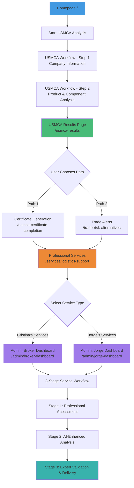

# Triangle Intelligence Platform - Workflow Analysis

## 📊 INTENDED WORKFLOW (According to CLAUDE.md)



## 🔍 CURRENT WORKFLOW (Based on Testing)

```mermaid
graph TD
    A[Homepage /] --> B[Start USMCA Analysis]
    B --> C[USMCA Workflow - Step 1<br/>✅ Company Information]
    C --> D[USMCA Workflow - Step 2<br/>✅ Product & Component Analysis]
    D --> E[USMCA Results Page<br/>❓ /usmca-results NOT TESTED]

    E -.->|Intended Path 1| G[Certificate Generation<br/>❓ /usmca-certificate-completion]
    E -.->|Intended Path 2| H[Trade Alerts<br/>⚠️ Requires completed workflow]

    H -.-> I[Shows: "Complete USMCA Analysis Required"]

    G -.->|Should lead to| J[Professional Services]

    J -.->|User selects service| K[Creates service_request in DB]

    K -->|Service assigned| L1[Admin: Cristina Dashboard<br/>✅ FULLY FUNCTIONAL]
    K -->|Service assigned| L2[Admin: Jorge Dashboard<br/>✅ FULLY FUNCTIONAL]

    L1 --> M1[✅ USMCA Certificates - 3 stages working]
    L1 --> M2[✅ HS Classification - 3 stages working]
    L1 --> M3[✅ Crisis Response - 3 stages working]

    L2 --> N1[✅ Supplier Sourcing - 3 stages working]
    L2 --> N2[✅ Manufacturing Feasibility - 3 stages working]
    L2 --> N3[✅ Market Entry - 3 stages working]

    style A fill:#4299e1
    style C fill:#48bb78
    style D fill:#48bb78
    style E fill:#fbd38d
    style H fill:#fc8181
    style L1 fill:#9f7aea
    style L2 fill:#9f7aea
    style M1 fill:#38b2ac
    style M2 fill:#38b2ac
    style M3 fill:#38b2ac
    style N1 fill:#38b2ac
    style N2 fill:#38b2ac
    style N3 fill:#38b2ac
```

## 🎯 WORKFLOW COMPARISON

### ✅ Working Components

| Component | Status | Notes |
|-----------|--------|-------|
| Homepage | ✅ Fully functional | Professional design, all CTAs working |
| USMCA Workflow Step 1 | ✅ Fully functional | Form validates, saves to localStorage |
| USMCA Workflow Step 2 | ✅ Fully functional | Component breakdown working |
| Cristina Dashboard | ✅ Fully functional | 3 services, all workflows operational |
| Jorge Dashboard | ✅ Fully functional | 3 services, all workflows operational |
| Database Integration | ✅ Complete | subscriber_data column added, 35 records migrated |
| Admin Workflows | ✅ Complete | All 6 services have 3-stage workflows |

### ⚠️ Untested Components

| Component | Status | Issue |
|-----------|--------|-------|
| `/usmca-results` | ❓ NOT TESTED | Results page after completing workflow |
| `/usmca-certificate-completion` | ❓ NOT TESTED | Certificate generation flow |
| `/trade-risk-alternatives` with data | ⚠️ REQUIRES WORKFLOW | Shows "Complete workflow" message without data |
| Professional Services Selection | ❓ NOT TESTED | `/services/logistics-support` page |
| User → Service Request Creation | ❓ NOT TESTED | How users create service requests |

### 🔴 Identified Workflow Gaps

#### Gap 1: Missing Results Page Testing
**Expected Flow:**
```
USMCA Workflow Step 2 → USMCA Results → Choose Certificate OR Alerts
```

**Current Reality:**
- Results page exists but wasn't tested
- Don't know if it displays properly
- Don't know if dual-path choice works

#### Gap 2: Trade Alerts Requires Completed Workflow
**Expected Flow:**
```
User completes workflow → Results stored in localStorage → Alerts show personalized risks
```

**Current Reality:**
- Alerts page correctly checks for workflow data
- Shows appropriate "Complete workflow first" message
- Tested with mock data but localStorage key mismatch (`usmca_workflow_data` vs `triangle_workflow_data`)

#### Gap 3: Service Selection Path Unclear
**Expected Flow:**
```
Results → Choose Services → Select specific service → Creates service_request → Admin processes
```

**Current Reality:**
- Admin dashboards work perfectly with existing service_requests
- Unclear how users select and purchase services
- `/services/logistics-support` page not tested

#### Gap 4: Certificate Generation Flow
**Expected Flow:**
```
Results → Certificate Generation → Authorization → Download certificate
```

**Current Reality:**
- Certificate completion page exists
- Not tested in user flow
- Admin can generate certificates via dashboard

## 🛠️ RECOMMENDED TESTING SEQUENCE

### Phase 1: Complete User Workflow (HIGH PRIORITY)
1. ✅ Homepage
2. ✅ USMCA Workflow Step 1 (Company Info)
3. ✅ USMCA Workflow Step 2 (Product Analysis)
4. ❌ **MISSING**: USMCA Results Page - TEST THIS
5. ❌ **MISSING**: Certificate Completion Flow - TEST THIS
6. ❌ **MISSING**: Trade Alerts with Real Data - TEST THIS

### Phase 2: Service Selection Flow (HIGH PRIORITY)
1. ❌ **MISSING**: Professional Services Page (`/services/logistics-support`)
2. ❌ **MISSING**: Service selection and payment flow
3. ❌ **MISSING**: Service request creation in database
4. ✅ Admin receives and processes requests (TESTED)

### Phase 3: End-to-End Integration (MEDIUM PRIORITY)
1. User completes workflow → Results saved
2. User selects professional service → service_request created
3. Admin processes service → 3-stage workflow
4. Service completion → User receives deliverable

## 📋 CURRENT STATE SUMMARY

### What's Working ✅
- **Database**: subscriber_data migration complete, all 35 records have data
- **Admin Dashboards**: Both Cristina and Jorge dashboards fully functional
- **Service Workflows**: All 6 professional services have complete 3-stage workflows
- **User Workflow Start**: Steps 1-2 of USMCA workflow functional

### What's Missing ❓
- **Results Page**: Not tested, don't know if dual-path works
- **Certificate Flow**: Not tested end-to-end
- **Service Selection**: User-facing service selection page not tested
- **Trade Alerts with Data**: Requires completed workflow (by design)

### Critical Path for Launch 🚀
1. **TEST**: `/usmca-results` page displays correctly
2. **TEST**: Certificate generation flow works end-to-end
3. **TEST**: Service selection creates service_requests properly
4. **VERIFY**: Trade alerts show after completing full workflow
5. **VALIDATE**: Complete user → admin → completion flow

## 🎯 WORKFLOW INTEGRITY ANALYSIS

### Data Flow (Current Reality)
```
User Input (Steps 1-2)
  ↓
localStorage (usmca_workflow_data)
  ↓
Results Page (reads localStorage)
  ↓ (if user selects service)
Database (service_requests table with subscriber_data)
  ↓
Admin Dashboard (reads service_requests)
  ↓
3-Stage Workflow (updates service_request status)
  ↓
Completion (service marked complete)
```

### Missing Connections
1. **Results → Services**: How does user selection create service_request?
2. **Certificate → Database**: Is certificate data saved?
3. **Alerts → Persistence**: Are alert preferences saved?

## 🔧 NEXT STEPS

1. **Complete user workflow testing** (Steps 3-4)
2. **Test service selection page**
3. **Verify end-to-end data flow**
4. **Document any workflow issues found**
5. **Fix localStorage key consistency** (`usmca_workflow_data` everywhere)

---

**Generated**: October 1, 2025
**Status**: Launch readiness testing in progress
**Critical Blocker**: None identified (admin workflows complete)
**Priority**: Validate remaining user-facing workflows
