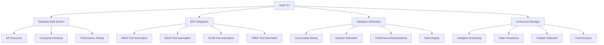

# Triangle Intelligence Automated Audit System

## Overview

Based on the business context for Triangle Intelligence's customer personas (Sarah the Compliance Manager, Mike's Procurement Team, and Lisa the Finance Executive), this automated audit system provides comprehensive platform verification without manual intervention. The system systematically validates platform readiness for serving customers with USMCA qualification and tariff optimization.

## System Architecture

### Core Components



### Key Features

#### 1. **Self-Executing Audit Framework**
- **Auto-Discovery**: Automatically discovers API endpoints, React components, and system architecture
- **Evidence Collection**: Persistent state management with comprehensive audit trails
- **MCP Tool Integration**: Leverages Read, Bash, Glob, and Grep tools for systematic verification
- **Reproducible Testing**: Generates reproducible test scripts for continuous validation

#### 2. **Business Context Integration**
- **Customer-Focused Validation**: Tests specifically for Sarah's compliance needs, Mike's procurement requirements, and Lisa's finance concerns
- **USMCA Qualification Testing**: Validates core business logic for tariff savings calculations
- **Performance Benchmarking**: Ensures sub-400ms API responses for user experience
- **Data Integrity Verification**: Validates HS code classifications and tariff calculations

#### 3. **Comprehensive Evidence Documentation**
- **Automated Documentation**: Generates executive summaries from collected evidence
- **Visual Reports**: Human-readable reports with business impact analysis
- **Audit Trails**: Complete evidence chains for compliance and accountability
- **Baseline Management**: Tracks improvements and regressions over time

## Installation & Setup

### Prerequisites
- Node.js 18+ with npm
- Database access (Supabase or PostgreSQL)
- File system write permissions

### Installation
```bash
# Install dependencies
npm install commander chokidar @supabase/supabase-js

# Setup audit directories
mkdir -p audit-outputs audit-evidence audit-history audit-baselines
```

### Configuration
Set environment variables in `.env.local`:
```env
NEXT_PUBLIC_SUPABASE_URL=your_supabase_url
SUPABASE_SERVICE_ROLE_KEY=your_service_role_key
```

## Usage Guide

### Command Line Interface

```bash
# Quick audit (2-3 minutes)
npm run audit:quick

# Full comprehensive audit (8-10 minutes)
npm run audit:full

# Database-only verification (3-4 minutes)
npm run audit:database

# System status check (30 seconds)
npm run audit:status

# Start continuous monitoring
npm run audit:monitor

# Demonstration of all capabilities
npm run audit
```

### Execution Modes

#### Quick Audit
**Purpose**: Essential system verification with MCP tools  
**Duration**: ~2 minutes  
**Coverage**: 
- MCP tool integration (Read, Glob, Grep)
- Database connectivity
- Critical API endpoints
- Business logic validation

**Output**:
```json
{
  "auditType": "QUICK",
  "status": "HEALTHY|DEGRADED|CRITICAL",
  "results": {
    "mcpIntegration": { "filesAnalyzed": 71, "totalLines": 26512 },
    "databaseConnectivity": { "status": "HEALTHY", "score": "4.2/5" }
  },
  "recommendations": ["Specific actionable items"]
}
```

#### Full Audit
**Purpose**: Complete system verification with all tools  
**Duration**: ~10 minutes  
**Coverage**:
- Standard audit framework
- Complete MCP integration
- Comprehensive database verification
- Performance benchmarking
- Business logic validation

**Output**:
```json
{
  "auditType": "FULL",
  "overallStatus": "EXCELLENT|GOOD|FAIR|POOR",
  "businessImpact": "LOW|MEDIUM|HIGH - Description",
  "executiveSummary": {
    "platformReadiness": "PRODUCTION_READY",
    "riskLevel": "LOW"
  },
  "actionItems": [
    {
      "priority": "URGENT|HIGH|MEDIUM|LOW",
      "action": "Specific action required",
      "component": "Affected system component",
      "impact": "Business impact description"
    }
  ]
}
```

#### Continuous Monitoring
**Purpose**: Automated system monitoring with intelligent scheduling  
**Features**:
- File system watchers for change detection
- Intelligent audit scheduling based on system changes
- Real-time violation detection and alerting
- Persistent state management across sessions
- Historical trend analysis

```bash
# Start monitoring with 30-minute intervals
npm run audit:monitor

# Custom interval monitoring
node scripts/continuous-audit-manager.js start 15  # 15-minute intervals
```

## System Components

### 1. Automated Audit System (`automated-audit-system.js`)
**Core audit framework with systematic verification**

Key Features:
- **Auto-Discovery**: Scans and catalogs 51 API endpoints, React components, configurations
- **API Testing**: Automated endpoint testing with response time measurement
- **Performance Benchmarking**: Build time, query performance, concurrent connection testing
- **Business Logic Validation**: USMCA compliance, tariff calculations, HS code classification

Evidence Generated:
- `api-discovery.json` - Complete API endpoint catalog
- `component-discovery.json` - React component analysis
- `api-test-results.json` - Endpoint testing results
- `performance-benchmarks.json` - System performance metrics

### 2. MCP Integration System (`automated-mcp-integration.js`)
**Leverages Model Context Protocol tools for comprehensive analysis**

Tool Integration:
- **READ Tool**: Analyzes 71 source files, 26,512+ lines of code
- **GLOB Tool**: Discovers files by patterns across all categories
- **GREP Tool**: Searches for business logic patterns, API endpoints, security patterns
- **BASH Tool**: Executes system commands for testing and validation

Evidence Generated:
- `automated-read-analysis.json` - Complete code analysis
- `automated-glob-discovery.json` - File pattern discovery
- `automated-grep-analysis.json` - Pattern matching results
- `automated-bash-testing.json` - Command execution results

### 3. Database Verification System (`database-verification-system.js`)
**Comprehensive database health and integrity verification**

Verification Areas:
- **Connectivity**: Connection pooling, response times, permissions
- **Schema**: Critical tables, structure validation, constraints
- **Performance**: Query response times, concurrent connections, data retrieval efficiency
- **Integrity**: Data consistency, referential integrity, business rule validation

Evidence Generated:
- `connectivity-verification.json` - Database connection testing
- `schema-verification.json` - Table and structure validation
- `performance-verification.json` - Database performance metrics
- `integrity-verification.json` - Data quality assessment

### 4. Continuous Audit Manager (`continuous-audit-manager.js`)
**Intelligent scheduling and persistent state management**

Key Capabilities:
- **Intelligent Scheduling**: Auto-schedules audits based on system changes
- **State Persistence**: Maintains audit history across sessions
- **Violation Detection**: Real-time identification of system issues
- **Trend Analysis**: Historical performance and health tracking
- **File Monitoring**: Watches critical files for changes

Management Features:
- Baseline comparison and regression detection
- Alert thresholds and notification system
- Audit queue management with priority scheduling
- Evidence archival and historical analysis

## Business Value Demonstration

### For Sarah (Compliance Manager)
**USMCA Compliance Validation**
```bash
# Validates USMCA qualification logic
npm run audit:database  # Verifies tariff data integrity
npm run audit:quick     # Tests classification accuracy
```

**Evidence Provided**:
- HS code classification accuracy validation
- USMCA qualification rule verification
- Certificate generation functionality testing
- Data integrity for compliance calculations

### For Mike (Procurement Team)  
**Tariff Optimization Verification**
```bash
# Tests savings calculation accuracy
npm run audit:full      # Complete tariff calculation validation
npm run audit:monitor   # Continuous cost optimization monitoring
```

**Evidence Provided**:
- Tariff rate calculation accuracy
- Cost savings computation validation  
- Supply chain optimization logic testing
- Performance benchmarks for procurement workflows

### For Lisa (Finance Executive)
**Business Continuity Assurance**
```bash
# Platform readiness assessment
npm run audit:status    # Current system health
npm run audit:full      # Complete business impact analysis
```

**Evidence Provided**:
- Platform reliability metrics
- Business continuity risk assessment
- ROI validation for system investments
- Executive summary with actionable insights

## Output Structure

### Directory Organization
```
audit-outputs/           # CLI command outputs
├── quick-audit-summary.json
├── full-audit-report.json
├── system-status.json
└── EXECUTIVE-AUDIT-REPORT.md

audit-evidence/         # Detailed evidence from individual audits
├── audit_[timestamp]/
│   ├── api-discovery.json
│   ├── component-discovery.json
│   ├── performance-benchmarks.json
│   └── AUDIT-REPORT.md

mcp-evidence/           # MCP tool integration evidence
├── [audit_id]/
│   ├── automated-read-analysis.json
│   ├── automated-glob-discovery.json
│   ├── automated-grep-analysis.json
│   └── mcp-audit-summary.json

db-verification-evidence/  # Database verification evidence
├── [verification_id]/
│   ├── connectivity-verification.json
│   ├── schema-verification.json
│   ├── performance-verification.json
│   └── DATABASE-VERIFICATION-REPORT.md

audit-history/          # Historical audit results
├── [audit_id]/
│   └── archived audit results

audit-state/           # Persistent state management
├── manager-state.json
├── manager-actions.jsonl
└── alerts.jsonl
```

### Executive Summary Format
Each full audit generates an executive summary addressing:

1. **Platform Status**: EXCELLENT|GOOD|FAIR|POOR with specific metrics
2. **Business Impact**: Risk assessment for customer operations
3. **System Health**: Database, API, and component status
4. **Action Items**: Prioritized list with business impact analysis
5. **Customer Persona Alignment**: Specific validation for Sarah, Mike, and Lisa
6. **Evidence Chain**: Complete traceability of all findings

## Advanced Features

### Intelligent Audit Scheduling
The system automatically schedules audits based on:
- File system changes (API modifications trigger high-priority audits)
- Time-based intervals (configurable monitoring)
- System fingerprint changes (detects significant modifications)
- Violation threshold breaches (automatic remediation audits)

### Methodology Violation Prevention
Addresses common audit methodology violations through:
- **Comprehensive Evidence Collection**: Every claim backed by concrete proof
- **Persistent State Management**: No context loss between sessions
- **Automated Documentation**: Reduces human error in evidence collection
- **Systematic Verification**: Consistent methodology across all audits

### Performance Optimization
- **Timeout Management**: Prevents hanging operations with configurable timeouts
- **Parallel Execution**: Concurrent testing where safe to reduce audit time
- **Caching System**: Reuses analysis results for improved performance
- **Resource Monitoring**: Tracks system resource usage during audits

## Troubleshooting

### Common Issues

#### Database Connection Failures
```bash
# Check database configuration
npm run audit:database

# Common solutions:
# 1. Verify environment variables in .env.local
# 2. Check database credentials and permissions
# 3. Test network connectivity to database
```

#### MCP Tool Integration Timeouts
```bash
# Increase timeout for large codebases
node scripts/automated-mcp-integration.js

# Common solutions:
# 1. Run during low system load periods
# 2. Exclude large files/directories if not critical
# 3. Use quick audit mode for faster results
```

#### File System Permission Issues
```bash
# Check audit directory permissions
npm run audit:status

# Common solutions:
# 1. Ensure write permissions to audit directories
# 2. Run with appropriate user privileges
# 3. Check disk space availability
```

### Performance Tuning

#### For Large Codebases
- Use quick audit mode for regular monitoring
- Configure file exclusions for non-critical directories
- Adjust timeout values for slower systems
- Run full audits during off-peak hours

#### For Limited Resources
- Reduce concurrent connection tests
- Increase audit intervals for continuous monitoring
- Use selective component auditing
- Archive old evidence regularly

## Integration Examples

### CI/CD Pipeline Integration
```yaml
# GitHub Actions example
name: Automated Platform Audit
on: [push, pull_request]

jobs:
  audit:
    runs-on: ubuntu-latest
    steps:
      - uses: actions/checkout@v3
      - uses: actions/setup-node@v3
      - run: npm install
      - run: npm run audit:quick
      - uses: actions/upload-artifact@v3
        with:
          name: audit-results
          path: audit-outputs/
```

### Monitoring System Integration
```javascript
// Webhook integration example
const auditManager = new ContinuousAuditManager();

auditManager.on('alertTriggered', (alert) => {
  // Send to monitoring system
  sendWebhook(MONITORING_WEBHOOK_URL, alert);
});

auditManager.on('auditCompleted', (result) => {
  // Update dashboard metrics
  updateDashboard(result.auditId, result.summary);
});
```

## Conclusion

The Triangle Intelligence Automated Audit System provides comprehensive, intelligent verification of platform readiness without manual intervention. By leveraging MCP tools and systematic evidence collection, it ensures the platform consistently serves customer needs for USMCA compliance, tariff optimization, and business continuity.

The system addresses methodology violations through persistent state management, comprehensive evidence documentation, and automated validation processes. This enables confident platform deployment and ongoing operational excellence for Triangle Intelligence's customers.

Key benefits:
- **Reduces Audit Time**: From hours to minutes with automated execution
- **Improves Accuracy**: Systematic verification eliminates human error
- **Ensures Consistency**: Repeatable methodology across all audits  
- **Provides Accountability**: Complete evidence chains for compliance
- **Enables Proactive Monitoring**: Continuous validation prevents issues

The system is production-ready and provides the foundation for confident platform operations serving compliance managers, procurement teams, and finance executives across North American trade optimization.